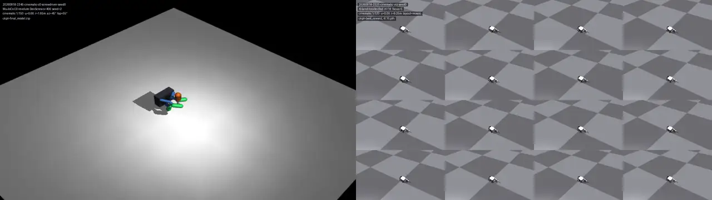

# Allegro-style tactile rod rotation MVP (MuJoCo + PPO)

<p align="center">
  
</p>
<p align="center">
  <em>Front demo — MuJoCo cinematic (left) · IsaacGym parallel envs (right)</em><br>
  <a href="https://ypx19.github.io/allegro_rod_mvp/">Interactive demo</a>
  ·
  <a href="docs/media/front-demo.mp4">MP4</a>
  ·
  <a href="docs/media/cinematic-screwdriver.mp4">MuJoCo clip</a>
  ·
  <a href="docs/media/cinematic-isaacgym.mp4">IsaacGym clip</a>
</p>

This repository is a Mac-friendly **phase-0 smoke test** for the planned task:

- Allegro-style joint-position control interface
- three tactile fingertips represented by low-dimensional contact features
- PPO
- fixed-tip / free-rod curriculum
- unwrapped rotation progress about the rod's own longitudinal axis

The included XML is deliberately mesh-free and uses a simplified three-finger hand, so installation and reward debugging are not blocked by Allegro assets or a fragile initial grasp. It is **not yet the final Allegro embodiment**. A script is included to fetch Google DeepMind's MuJoCo Menagerie Allegro V3 model for the next integration step.

## 1. Setup on Apple Silicon Mac

Use native arm64 Python 3.10–3.12. In Terminal:

```bash
xcode-select --install  # skip when already installed
cd allegro_rod_mvp
python3 -m venv .venv
source .venv/bin/activate
python -m pip install --upgrade pip setuptools wheel
pip install -e .
```

Verify architecture when needed:

```bash
python -c "import platform; print(platform.machine())"
# expected: arm64
```

Do not install `mujoco-py`; this project uses the official `mujoco` Python package.

## 2. Smoke test

```bash
python scripts/check_env.py
python scripts/random_play.py
```

`random_play.py` opens the native MuJoCo passive viewer. Close the viewer or press Ctrl-C in Terminal to stop.

## 3. Train curriculum stage 0

Stage 0 activates a point equality that anchors the rod tip. It tests whether PPO can discover positive axial rotation without first solving free-object stabilization.

```bash
python scripts/train.py --stage 0 --steps 150000
```

Play the result:

```bash
python scripts/play.py checkpoints/stage0/final_model.zip --stage 0
```

On a MacBook, start with one environment and CPU training as configured. The purpose is behavioral validation, not throughput.

## 4. Continue the curriculum

Stage 1 removes the physical anchor and keeps a shaped tip-position penalty:

```bash
python scripts/train.py \
  --stage 1 \
  --steps 250000 \
  --resume checkpoints/stage0/final_model.zip
```

Stage 2 tightens tip tolerance and randomizes rod friction and mass:

```bash
python scripts/train.py \
  --stage 2 \
  --steps 400000 \
  --resume checkpoints/stage1/final_model.zip
```

## 5. Metrics printed by play.py

- `axis_rotation_deg`: unwrapped accumulated longitudinal rotation
- `tip_error_m`: rod-tip displacement from the reset target
- `contact_count`: fingertips reporting contact

A first useful result is more than 180 degrees in the intended direction while keeping tip error below 2 cm without dropping.

## 6. Current low-dimensional tactile observation

Each fingertip contributes:

- scalar MuJoCo touch force
- 2-D contact-center estimate in the fingertip local frame

The full observation also includes joint state, rod-tip error, rod angular velocity, accumulated rotation, and sin/cos of the unwrapped angle. Object truth is intentionally still present in this phase because the first question is whether the mechanics, action parameterization, and reward are learnable.

## 7. Fetch the official Allegro model

```bash
./scripts/fetch_allegro_model.sh
```

This downloads `external/mujoco_menagerie/wonik_allegro`. The next implementation step is to:

1. compose `right_hand.xml` into a task scene;
2. build a stable initial three-finger grasp around the rod;
3. add tactile sites/contact-center extraction to three selected fingertips;
4. preserve the same Gymnasium API and reward implementation;
5. expand the 9-action debug interface to Allegro's 16 actuators.

## Known limitations

- The smoke-test hand is not kinematically identical to Allegro.
- The `axial_slip_proxy` is only diagnostic in this first version.
- Contact-center features come from MuJoCo contact points, not a taxel or DIGIT image simulator.
- Stage transfer with `PPO.load()` only works when observation and action dimensions remain unchanged, which they do across the three included stages.
- A successful stage-0 policy does not by itself prove free-rod in-hand reorientation; stage 1 is the meaningful checkpoint.
