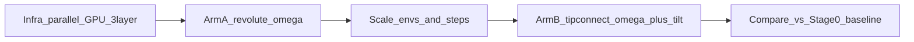

# DexScrew-Style RL Exploration (MuJoCo + SB3)

**Status:** Arm A (revolute+ω) working; Arm B tip-connect+tilt failed gate at 1e6 (tilt terminations)  
**Decisions:** stack **1A** (MuJoCo + SB3 `SubprocVecEnv`); physics ablation **2C** (revolute first, then tip-connect + tilt penalty)  
**Overview:** New exploration track that imitates DexScrew’s RL recipe (ω reward, privileged obs, 3-layer MLP, parallel envs) without leaving the current stack. Use the 8-GPU server for multi-seed / multi-config jobs, not Isaac Gym.

## Todos

| ID | Task | Status |
|---|---|---|
| infra-parallel | Add `SubprocVecEnv` + CUDA + `net_arch [512,256,128]` + `VecNormalize`; 8-env smoke on current Stage 0 | done (`20260802-0217-…`, EXP-20260802-001) |
| reward-core | DexScrew-style reward module (ω, proximity, pose anchor, energy, excess ω) with component logging | done (`rewards_dexscrew.py`) |
| arm-a-revolute | Revolute MJCF + `physics_mode`; hinge ω reward; privileged obs concat; smoke EXP-A0/A1 | done A0 (`20260802-1250-…`); A1 priv optional |
| scale-train | Scale to 64/256 envs and 1e7+ steps; 8-GPU multi-seed fan-out scripts | blocked on std stability (EXP-20260802-002 peak 5e6 / crash ~3e7; see DBG-20260802-001) |
| arm-b-tipconnect | Tip-connect arm with shared reward + tilt penalty, stabilizer 0; matched-budget EXP-B0 | attempted (`20260802-1305-…`, failed tilt gate) |
| compare-docs | Eval vs Stage 0/1 baseline; update METRICS / EXPERIMENT_LOG / PROJECT_STATE; comparison report | pending |

## Decisions (locked)

- **Stack:** MuJoCo + SB3 PPO + `SubprocVecEnv`, policy on CUDA ([`scripts/train.py`](../scripts/train.py) today uses `DummyVecEnv` + `device="cpu"`).
- **Physics ablation (2C):** Arm A = hard **revolute**; Arm B = **tip-connect** free rod with the **same** DexScrew-style reward **plus tilt punishment**.
- **Scope:** Oracle-style privileged actor/critic only (teacher). ProprioAdapt student / real BC deferred.

## Why this ordering

DexScrew’s ω reward is defined on a **1-DoF hinge**. Matching that first isolates gait learning. Tip-connect then tests whether the same recipe transfers when tilt is possible (our failure mode), with an extra tilt term.

## Reward redesign (shared core)

Port DexScrew terms into our units (see [`references/dexscrew/dexscrew/tasks/xhand_hora.py`](../references/dexscrew/dexscrew/tasks/xhand_hora.py) `compute_hand_reward` and screwdriver yaml scales):

| Term | Formula (concept) | Notes |
|---|---|---|
| Rotation | `clip(ω_axial, -4, 4) * rotate_scale` | **Replace** unwrapped Δθ primary reward |
| Proximity | `clip(1 - mean_fingertip_dist / d_thresh, 0, 1) * prox_scale` | Thumb+index analogue → fingers that can reach |
| Pose anchor | `-‖q - q0‖² * pose_scale` | Reset grasp; optional finger mask |
| Action/energy | action-rate and/or ctrl effort penalties | Map torque/work (we lack effort DOF drive) |
| Excess ω | `-max(0, ω - ω_thresh) * excess_scale` | Curriculum later if needed |
| **Tilt (Arm B only)** | `-w_tilt * (tilt/σ)²` clipped | User-required; Arm A has none |

Keep logging of unwrapped angle / tip error / tilt as **metrics**, not primary reward (Arm A angle is hinge angle).

**Observation:** shared fixed layout (dim 42) across revolute and tip-connect so Arm A checkpoints can initialize Arm B (`hand q/v`, contacts, tip error, ω features, rod axis, tilt, linvel).

Config defaults start near DexScrew screwdriver: `rotate_scale≈2.5`, `prox≈2.0`, `pose≈0.1`, mild energy; then one-factor retune only if smoke fails.

## Privileged information

Split observation into:

- **Proprio / policy-facing:** joint q, last action or targets, contact features (existing tactile-lite), short history optional later.
- **Privileged (oracle):** rod pose/quat, tip error, axial ω, hinge angle/vel (Arm A), mass/friction (if randomized), fingertip positions, contact forces, curriculum id.

Implementation: concat priv into obs for both pi/vf (DexScrew teacher) in Phase 1; record dim in [`docs/METRICS.md`](METRICS.md).

Do **not** add point-cloud encoder in v1. Single capsule/hinge does not need it.

## Network and PPO

- `net_arch`: `pi` and `vf` **`[512, 256, 128]`** (3-layer backbone).
- Device: `cuda`.
- Start PPO knobs close to current, then migrate toward DexScrew where cheap: `ent_coef→0`, larger `batch_size` with more envs, `n_steps` such that `n_envs * n_steps` stays a sensible rollout (e.g. 64×128 or 256×64).
- Enable `VecNormalize` for reward and obs (DexScrew normalizes).

## Parallelism on 8 GPUs (realistic for 1A)

MuJoCo `SubprocVecEnv` is **CPU-bound**. Use GPUs for the **policy**; use cores for envs.

| Tier | `n_envs` | Steps (first) | Role |
|---|---:|---:|---|
| Smoke | 8 | 2e5 | Finite rewards, shapes, checkpoint |
| Mid | 64 | 2e6 | Learning curves |
| High | 256 | 1e7–5e7 | Main Arm A/B runs |

**8-GPU usage:** run **8 concurrent jobs** (seeds × arms × hyperparams), one GPU each — not data-parallel PPO across 8 GPUs. Target total interaction budget per main run **≥1e7** env steps; do **not** promise 1.5e9 (Isaac Gym scale).

## Physics arms

### Arm A — Revolute (new model)

- New MJCF e.g. [`models/three_finger_rod_revolute.xml`](../models/three_finger_rod_revolute.xml): rod constrained by **hinge** about longitudinal axis; tip/base fixed appropriately.
- Env flag `physics_mode=revolute` in [`allegro_rod_mvp/env.py`](../allegro_rod_mvp/env.py) or a thin subclass to avoid breaking Stage 0–2 defaults.
- Reward: shared core **without** tilt term.
- Success: sustain `axial_omega > 0.5 rad/s` for **10.0 s** consecutive (configurable); tip/tilt/drop gates. Angle is metric only — not reward, not success.
- **Arm B mass balance (B2):** online EMA adapts `rotate_scale` / `tilt_scale` so `|rot|` and `|tilt|` each ≈45% of Σ\|reward terms\| (`--adaptive-reward-mass`). PPO itself already updates every `n_steps` rollout (not per-episode).

### Arm B — Tip-connect + tilt penalty

- Existing tip-connect path; **axis stabilizer = 0** for the DexScrew-style arm (tilt handled by reward + tip joint), tip connect ON.
- Reward: shared core **+ tilt penalty** (and keep tip error penalty at a moderate “stability” weight so ω can lead).
- Success: same rotation metrics as A **and** mean tilt below threshold / low `axis_tilt` terminations.

## Experiment sequence (one important factor per EXP where possible)

1. **EXP-infra:** `SubprocVecEnv` + CUDA + `[512,256,128]` on **current** Stage 0 reward (short). Confirms parallel plumbing.
2. **EXP-A0:** Arm A revolute + ω reward core, `n_envs=8`, 2e5 smoke.
3. **EXP-A1:** Same + privileged concat, still 8 envs (obs change only).
4. **EXP-A2:** Scale to 64 then 256 envs, longer budget; fix reward if A0/A1 already learn.
5. **EXP-B0:** Arm B tip-connect + shared reward + tilt penalty; match A2 compute.
6. **EXP-compare:** vs current best Stage 0/1 checkpoint under **same eval protocol** (20 seeds); write [`reports/comparisons/`](../reports/comparisons/).

Baseline for comparison: existing Stage 0 tip-connect+stabilizer runs in [`PROJECT_STATE.md`](PROJECT_STATE.md) — report that assists differ.

## Code / config deliverables

- [`scripts/train_parallel.py`](../scripts/train_parallel.py) (or extend [`scripts/train.py`](../scripts/train.py)): `--num-envs`, `--device`, `--net-arch`, `--reward-style dexscrew`, `--physics revolute|tip_connect`, priv flags, VecNormalize.
- [`configs/dexscrew_style/arm_a_revolute.yaml`](../configs/dexscrew_style/arm_a_revolute.yaml), [`configs/dexscrew_style/arm_b_tipconnect.yaml`](../configs/dexscrew_style/arm_b_tipconnect.yaml).
- Reward component logging → `metrics.csv` / TB (raw + weighted), per AGENTS §10.
- Update [`METRICS.md`](METRICS.md), [`EXPERIMENT_LOG.md`](EXPERIMENT_LOG.md), [`PROJECT_STATE.md`](PROJECT_STATE.md) after each EXP.
- Server launch helpers: `scripts/server/` with 8-way seed fan-out example.

## Success criteria (pre-registered)

- **Infra:** no NaNs; `n_envs≥8` trains; checkpoints load.
- **Arm A:** after ≥2e6 steps, mean eval hinge progress ≫ baseline random; positive ω fraction > 0.7.
- **Arm B:** after matched steps, rotation competitive with Arm A **or** failure mode clearly tilt/drop with logged components; tilt terminations not 20/20 if A succeeds.
- **Claim bar:** do not claim “DexScrew matched” unless Arm A gait is strong under parallel training; Arm B remains the stress test for free lateral orientation.

## Out of scope (this track)

- Isaac Gym / MJX rewrite.
- Point-cloud encoder.
- ProprioAdapt student / real teleop BC.
- Full Allegro Menagerie embodiment.

## Related

- Method comparison: [`reports/comparisons/dexscrew_vs_allegro_rod_mvp.md`](../reports/comparisons/dexscrew_vs_allegro_rod_mvp.md)
- Finding: FIND-20260730-001 in [`FINDINGS.md`](FINDINGS.md)
- Reference clone: `references/dexscrew/` (gitignored)
